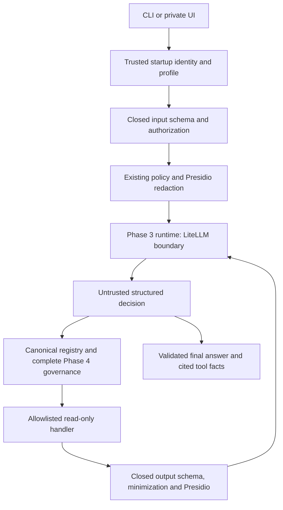

# Agent architecture and limits

## Shared trust boundary

The offline test double replaces only the gateway client seam and analyzer/anonymizer service seams. The core uses the same validation/governance coordinator as the repository runtime. There is no alternative tool registry format, policy engine, approval bypass or direct provider connection.

## Contracts and dispatch

The canonical [agent registry instance](../../contracts/agents/tool-registry.json) is loaded by the existing Phase 4 registry validator. Five tools bind to exact committed input/output schemas. Swapping a schema reference, enabling a write, requiring an approval, changing an action/risk/version or selecting a tool outside the profile fails closed. The read-only policy implements the existing Phase 3/4 interfaces in `runtime/phase4/tool_policy.py`.

| Profile | Registered tool | Required action | Result |
| --- | --- | --- | --- |
| Infrastructure | `read_ci_summary` | `diagnostics.ci` | Approved synthetic scenario evidence |
| Infrastructure | `read_image_summary` | `diagnostics.image` | Synthetic qualification summary |
| Infrastructure | `read_runbook_section` | `diagnostics.runbook` | Approved bounded suggestion |
| Financial | `expense_summary` | `expenses.summary` | Tenant/period aggregate |
| Financial | `expense_categories` | `expenses.categories` | Deterministic ranked category aggregates |

All metadata describes read-only internal tools, with two-second operation limits and one execution per tool per run. Arguments select enum sections or a validated month. They cannot select files, URLs, commands, tenant identifiers, credentials, schemas or provider configuration. Paths are code-selected, bounded and reject symlinks. The core calls the authoritative governance coordinator, then checks its trusted tenant against the run's tenant before dispatch. Qualification alone remains insufficient for execution outside this coordinator.

Model decisions use the closed [decision schema](../../contracts/agents/decision.schema.json), encoded inside the existing Phase 3 `summary` string. The original `{summary, classification}` gateway response contract stays intact. Unknown keys, invalid tool IDs, schema violations, duplicate dispatches, fabricated evidence IDs, wrong agent/period and suspected injection block the run. Tool results are validated, assessed, minimized and redacted before another model call. Final answers are also redacted and revalidated. Valid evidence references do not establish the semantic accuracy of every model-written statement; authoritative calculations are shown separately as tool facts.

## Identity and isolation

`DemoIdentity` is explicitly simulated authentication. A startup operator chooses `demo-alpha` or `demo-beta`; separate agent instances receive only their profile's actions. A private ephemeral bearer stays inside the process. The tenant reference is a 16-character keyed HMAC pseudonym; raw fixture tenant IDs do not enter prompts, results, audit events or browser configuration. The financial handler obtains its tenant exclusively from the governance-qualified server context.

For live integration, inject a real authenticator, resolver and authorizer. The live factory rejects simulated identity and refuses a client credential equal to a provided gateway master credential. This equality check cannot independently establish the role of an arbitrary key; gateway-side scope qualification is required. Offline startup requires an explicitly offline gateway; request content cannot enable simulation or live mode.

## Bounded execution

| Boundary | Default maximum |
| --- | --- |
| Model requests / tool dispatches | 4 / 4 per run |
| Overall run | 60 seconds |
| Each complete model stage | 20 seconds including its runtime controls |
| Each tool / governance / identity operation | 2 seconds |
| Standalone redaction operation | 10 seconds |
| Core message / assembled model prompt | 500 characters / 4,000 UTF-8 bytes |
| Tool/final JSON before and after redaction | 4,096 UTF-8 bytes |
| Private UI request / core response | 4,096 / 32,768 bytes |
| HTTP adapter response | 65,536 bytes |

Limits can be reduced at trusted startup and cannot be expanded. No automatic model, tool or evaluation retry exists. POSIX main-thread interval timers interrupt operations; the core refuses execution in a background thread or while another interval timer is active. The UI therefore uses a single-thread server. An integration must preserve this execution model or separately qualify an equivalent cancellation boundary. These in-process deadlines do not undo a remote operation already accepted by a server; initial tools are strictly read-only.

The existing HTTP adapters reject redirects and ignore ambient proxy settings, avoiding silent credential forwarding/rerouting. Inputs cannot select an endpoint. The private UI binds only to `127.0.0.1`, validates exact Host and same-origin POST requests, rejects forwarded/identity headers, requires a per-process CSRF token, disallows uploads/chunked/oversized bodies and serves only fixed assets. It uses CSP, no-store, no-referrer, nosniff and DOM text rendering. It records no request logs, persists no browser data and exposes no agent/provider credential. Other processes on the same host are outside its authentication guarantee; production use requires a separately secured service.

## English UI presentation

The private English LTR UI sends only agent, scenario and period selectors. English fixed messages are selected server-side; there is no language selector or request-selected identity/provider. A display projection runs after core validation and redaction. It adds no policy engine or tool permissions and preserves the original structured facts and canonical audit events.

Infrastructure supporting evidence consists of the synthetic CI source and approved runbook section. The invented image qualification fixture is labelled supplemental context with no current image-scan claim. Financial cards and rankings use tool aggregates; integer division and remainder with the SAR currency scale produce monetary strings. The projection rejects inconsistent aggregate/source/period/ranking results. It never derives amounts from model-written text.

Sanitized reports and audit traces are collapsed by default and downloadable without CSRF/provider credentials. Every displayed value is DOM text. The UI distinguishes simulated model request attempts, external provider calls and tool dispatch attempts; token usage and cost remain unavailable. Redaction accounting explicitly describes synthetic service doubles, not proven live Presidio detection.

## Remaining limitations

The illustrative injection assessor matches four categories; it does not prove complete detection. Independent authorization and tool/schema containment remain mandatory. Offline redaction doubles do not prove production Presidio coverage. Audit events qualify attempted tools and are kept in memory; durable delivery is not implemented. Real user authentication, production tenant/RLS integration, real model response quality, Arabic language coverage, gateway key scope and live network containment remain unproven. Google SDP's separate inconclusive evaluation is not a provider-authority decision.
