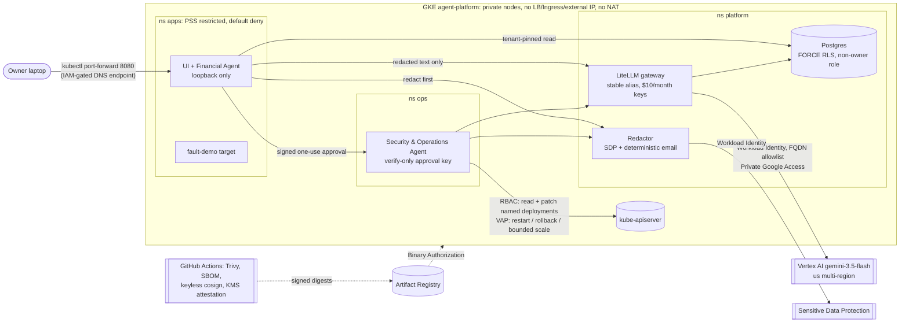

# Architecture and trust boundaries

## Agent platform (Phase E, [ADR-008](architecture/decisions/ADR-008-persistent-agent-platform.md))

One private GKE cluster runs on demand (1 node while working, 0 when idle). Every control is enforced inside the system,
not by operator procedure.

| Boundary | Enforced by | Evidence |
|---|---|---|
| No public exposure | private nodes and endpoint; no LB/Ingress; quota `services.loadbalancers: 0` | render invariants (`make test`), live attack suite |
| Namespace isolation | default-deny NetworkPolicies + explicit paths; FQDN egress only for gateway (Vertex) and redactor (DLP) | render invariants, live attack suite (direct egress blocked) |
| Workload hardening | Pod Security "restricted" in every namespace; nonroot, read-only root, no capabilities | `make test-policies` (real kube-apiserver), render invariants |
| Tenant isolation | Postgres FORCE ROW LEVEL SECURITY; app role non-owner, NOBYPASSRLS; tenant set server-side | bootstrap contract check, live attack suite (cross-tenant read) |
| Redaction before any model call | `RedactorClient` raises on any failure, so the gateway is never called | unit tests, live attack suite (redactor down → 0 spend) |
| Ops agent authority | RBAC (read + patch named deployments) and a ValidatingAdmissionPolicy (restart / rollback / bounded scale only) | `make test-policies`: allowed and denied cases on a real API server |
| Human approval | Ed25519 one-use tokens signed only by the front door (owner passphrase); the agent holds only the public key | unit tests (binding, expiry, replay, forgery, restart) |
| Supply chain | Trivy + SBOM + keyless cosign in CI; Binary Authorization with a KMS attestor rejects unattested digests | CI receipts, live attack suite (unsigned image rejected) |
| Model text and logs | treated as data: diagnosis is deterministic; explanations are redacted, display-only and cannot change targets or actions | unit tests (log-planted instruction), live attack suite |

Cloud specifics live behind a contract in `platform/clouds/gke`. See the [porting guide](porting-guide.md); portability is
documented, not tested.

## Reference control path (unchanged, reused by the platform)

The reference runtime enforces the sequence in `runtime/phase3/trusted_runtime.py`:

- Authentication derives identity, and the tenant resolver derives tenant context from trusted claims. Caller-supplied tenant fields are rejected.
- Authorization and policy must succeed before redaction or LiteLLM is called.
- The runtime consumes a provider-neutral redaction result.
- The sole concrete Presidio adapter validates Analyzer spans and verifies protected fragments are absent from Anonymizer output before returning that result.
- Provider output must satisfy the closed structured result shape.
- Any failed control stops the sequence and emits a sanitized failure category.

Phase 4 provides a registry and a governance coordinator for tool requests:

- Tool metadata binds an action, risk class, schemas, limits and approval requirement.
- Unknown or disabled tools fail closed.
- Prompt-injection assessment, policy and verified human approval are explicit boundaries before any execution.
- Audit events use a closed schema and exclude raw prompts, arguments, credentials and tenant identifiers.

The platform composes these unchanged agent cores (`IntegratedCore`, `TenantDatabaseTools`, `DeterministicEmailRedactor`) with in-cluster transports.

This repository is a portfolio reference implementation with synthetic data only. Each claim is classified in the README claims
matrix as implemented and live-tested, implemented but not live-tested, documented only, or future.
